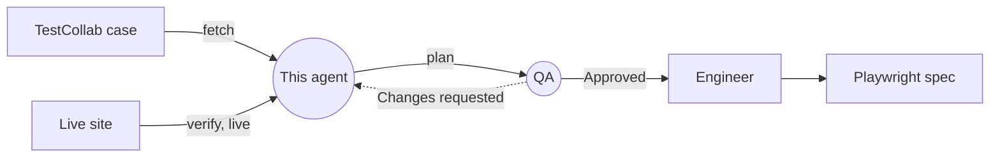
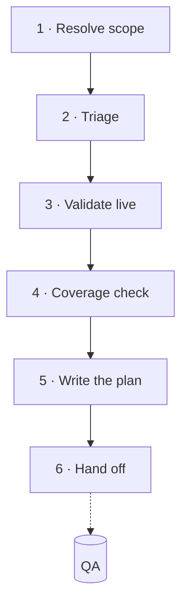
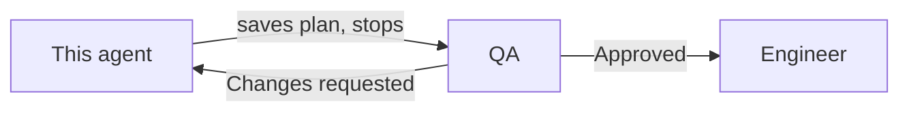

# TestCollab Planner

*Turns a TestCollab test case into a validated, generator-ready Playwright plan — by checking the live site, not just trusting the case.*

| | |
|---|---|
| **Role** | Planner — first of three steps: Planner → [`QA`](QA.agent.md) → [`Engineer`](Engineer.agent.md) |
| **Hands off to** | [`playwright-testcollab-qa`](QA.agent.md) — generation only happens after QA approves |
| **Model** | Claude Sonnet 4.6 |
| **Reads from** | TestCollab (cases, suites, plans) + the live site (via a real browser) |
| **Writes** | A plan file (`specs/*-plan.md`) — and, gated behind an explicit ask, TestCollab case updates (tagging on a pass is QA's job, not this agent's) |

**Contents:** [What this is](#what-this-is) · [How a run goes](#how-a-planning-run-actually-goes) · [Writing back to TestCollab](#writing-back-to-testcollab) · [What "good" looks like](#what-good-looks-like)

## What this is

This is the first of three steps for turning manual TestCollab test cases into
Playwright specs. It does the research and writes a plan; a separate agent, QA,
independently re-verifies it; only then does a third agent, Engineer, turn it into
actual test code.



The reason it's split into two steps at all comes down to one rule this agent is built
around:

> **TestCollab is the source of truth for what a test case *should* say, but the live
> site is the source of truth for what the app *actually does* — and those two things
> drift out of sync over time.**

A manual test case might describe a button that got renamed six months ago, or a field
that's since become optional. If a planner just transcribed the case as written, every
generated test would be built on stale assumptions. So instead, this agent's whole job
is to go check: fetch what TestCollab says, walk through it for real in a browser, and
write down what's actually true — flagging every place the two disagree instead of
quietly picking one.

That's the defining rule, in one sentence:

> **Never invent a scenario and pass it off as a TestCollab case, and never silently
> edit a case to match the app.**

Every scenario that comes out of this agent is either traced back to a real TC ID, or
explicitly labelled `Proposed (not in TestCollab)` if it's a gap the agent noticed but
TestCollab doesn't have a case for.

## How a planning run actually goes



### 1. Figure out what's being asked for

Before anything else, it calls `get_project_context` — this pulls in the suite tree,
tags, custom fields, and other IDs that every later lookup depends on.

Then it works out the scope from what the user actually said:

| What the user gives it | What it does |
|---|---|
| Specific IDs ("TC-1455", "1455, 1460") | Fetches each one directly, with reusable steps parsed |
| A suite name | Resolves the suite ID from project context, lists its cases |
| A test plan / release / cycle | Fetches the plan, then every case inside it |
| A tag or filter ("all smoke cases") | Filters by tag, priority, automation status, etc. |
| Nothing specific | Lists the suite tree and asks — it won't guess and dump the whole project |

Whatever the scope resolves to, it always finishes by calling `get_test_case` on each
one individually. The list endpoints only return metadata — titles, priorities, tags —
not the actual steps, and steps are the whole point. If there's more than 100 cases and
it has to cap the fetch, it says so explicitly rather than letting a partial fetch look
like full coverage.

### 2. Sort the cases before spending any browser time

Every case gets classified before the agent goes anywhere near a browser:

- **Automate** — a deterministic flow with a checkable outcome.
- **Automate with setup** — same, but it needs something first: seeded data, a specific
  account, a file fixture. The plan says exactly what's missing.
- **Not worth automating** — anything that needs a human's judgment to verify (does this
  look right? did the email actually arrive?), or a one-off check that isn't worth
  maintaining as a script.
- **Blocked** — depends on something the agent can't reach or solve: a third-party
  sandbox, a captcha, an environment it has no access to.

Only the first two categories go on to get walked through in the browser. Everything
else lands in the summary table with a one-line reason instead.

One more check happens here too: if TestCollab already flags a case as automated
(`is_automated` / `automation_status`), the agent confirms a spec for it genuinely
exists in this repo before planning it again — a stale flag isn't taken at face value.

Two categories of step are always out of scope here, by standing project convention,
regardless of how a case would otherwise be classified: **mobile-viewport /
responsive-resize checks** (this repo doesn't run mobile emulation), and
**screenshot/visual-regression comparisons** (there's no baseline image set to compare
against). These get called out under "Drift found" as deliberately excluded, not
quietly dropped.

### 3. Actually go check, in the browser

This is the part that makes the agent trustworthy rather than just plausible-sounding.
For every case that made it through triage, the agent opens the real page and walks the
steps as written, asking of each one:

- Does the element the step names actually exist, from the state the step assumes
  you're starting from?
- Is it unambiguous — will a locator find exactly one match, or does it need a
  qualifier?
- Does the expected result actually show up, and *how* is that observable — a URL
  change, a toast message, a heading, a row appearing in a list? Prefer durable state
  (the item is, or isn't, in the CMS) over transient signals like a toast: a message can
  be missed, or shown to a different tab.
- Does this step secretly depend on state left behind by an earlier case? If so, that's
  a problem — scenarios need to stand on their own.

Wherever the case and the app disagree, that's **drift**, and it gets written down, not
edited away. A renamed button, a field that's now required, a step that used to be one
click and is now two — all of it goes in the plan's "Drift found" section so a human can
decide which side needs to change. The agent also watches the browser console and
network tab while it's in there; errors a manual tester would never have noticed often
explain why a step's expected result is flaky.

### 4. Check what already exists before writing anything new

Before drafting a single line of the plan, the agent searches `tests/` and `specs/` for
prior work:

- **Does this case already have a spec?** Spec files are named after the test's title,
  not its TC ID, so the filename alone won't tell you. The real traceability lives in
  the spec's own header comment (`// spec: specs/tc-<id>-<slug>-plan.md`) and its
  `test()` title, which matches the TestCollab case title verbatim.
- **Are there specs with no TestCollab case behind them at all?** That's untracked
  automation — worth surfacing so it can be back-filled into TestCollab.
- **Is there already a helper for this?** `tests/helpers/` holds reusable functions for
  login, navigation, search, and other common flows. If one already covers a step, the
  plan references it by name instead of re-describing the interaction from scratch —
  that's what lets the generator reuse code instead of reinventing locators every time.
- **Is there an obvious gap next to a case being planned** — a missing negative path, a
  boundary condition, a permission variant nobody wrote a case for? The agent can
  propose it, but always under the `Proposed (not in TestCollab)` label, and never with
  a made-up TC number.

### 5. Write the plan

The finished plan gets submitted through `planner_save_plan`, in a fixed format the
generator agent knows how to consume: a coverage summary table, a drift section, and
then one numbered scenario per case, each carrying its TC ID, priority, tags,
preconditions, numbered steps with expected results, and explicit success/failure
criteria. Here's roughly what that looks like:

```markdown
# <Suite or plan name> — automation plan

**Source:** TestCollab project <name> (#<id>) · suite <name> (#<id>)
**Fetched:** <n> cases · **Planned:** <n> · **Deferred:** <n>
**Seed:** `tests/seed.spec.ts`

## Coverage summary

| TC ID | Title | Verdict | Existing spec | Notes |
|-------|-------|---------|---------------|-------|
| 1455 | Create blog post with all required fields | Automate | tests/create-blog-post-with-all-required-fields.spec.js | Step 11 image upload needs a fixture |
| 1460 | Export report to PDF | Not worth automating | — | Verifies rendered PDF visually |

## Drift found

- **TC-1455 step 9** — case says "Title field"; app labels it "Headline". Update the case in TestCollab.

### 1. Blog Post Creation
**Seed:** `tests/seed.spec.ts`

#### 1.1 Create blog post with all required fields
**TC:** 1455 · **Priority:** High · **Tags:** smoke, content
**Preconditions:** Logged in as an author (`tests/helpers/authHelper.js`); no draft with this title exists.

**Steps:**
1. Log in via `authHelper.loginWithMathChallenge` with credentials from `process.env.TC_USER` / `process.env.TC_PASS`
2. Navigate to Add content > News article / Blog post
   - **Expect:** the blog creation form is displayed
3. Enter a unique title in the Headline field
...

**Success criteria:** post is saved, the browser lands on the content view URL, and the new title is visible as the page heading.
**Failure conditions:** validation error on save, or the URL still matches `/add|create/`.
```

A few rules shape every plan body:

- One scenario per case, in TC order, titled with the case's exact TestCollab title —
  that title becomes the generated test's name, and matching titles is what keeps the
  round-trip traceable later.
- Where the app agrees with the case, the case's own wording is kept. Where it doesn't,
  the step is written the way the app *actually* behaves, and the disagreement is
  logged under "Drift found" so TestCollab can be corrected.
- Expected results get filled in concretely — a specific URL, heading, toast, or count —
  never something as vague as "works correctly."
- Anything a scenario deletes, removes, or changes gets its own step that verifies the
  result **in the CMS itself** — for a deletion, look the item up again (for example the
  Content list filtered by its title) and confirm it's gone, rather than relying on the
  "has been deleted" message. Status messages are transient and, in Drupal, live in the
  *session*, so with a shared session another tab can consume them. Run the same lookup
  *before* the delete as a positive control, so "not found" afterwards can't be a lookup
  that never worked.
- Every scenario has to be able to run alone, from a blank state, in any order. That
  means generating unique data (timestamped titles, unique emails) rather than reusing
  fixed values that would collide on a second run.
- Credentials never appear as literal values in a plan — always an env var or a helper
  reference. If a TestCollab case itself has a password typed into its steps, that gets
  flagged as a hygiene issue under "Drift found," and the plan uses the env-var form
  regardless.

### 6. Hand off to QA — and stop

As soon as `planner_save_plan` succeeds, this agent shows a short summary of what got
planned — the coverage table, the drift — and then **stops**. It does not generate
anything itself, and it does not proceed on its own judgment that the plan looks good.
The plan goes to [`QA`](QA.agent.md) next, which re-verifies a sample of the plan's
claims independently before anything gets generated from it.



If QA comes back with **Changes requested**, this agent addresses the specific items
raised and re-saves the plan — it doesn't argue the finding away or re-submit
unchanged. Only a plan QA has marked **Approved** moves on to generation.

## Writing back to TestCollab

This agent *can* update TestCollab cases (`update_test_case`), but treats that as a
gated action: it only writes back when the user explicitly asks for it, and only
touches the field they asked about. It always shows the exact change before making it.
What it will never do is edit a case's steps to paper over drift it found — the entire
point of reporting drift in the first place is that a human, not the agent, decides
which side (the case or the app) is actually wrong.

The one write-back that happens *without* being asked — tagging a case `automated` once
its spec passes — isn't this agent's job. That belongs to [`QA`](QA.agent.md), which
sees Engineer's pass/fail report directly and is the one that updates TestCollab
accordingly.

## What "good" looks like

Every plan this agent produces is held to the same four things:

- **Traceable** — every scenario carries a real TC ID, or is clearly marked proposed.
- **Honest** — deferred cases, capped fetches, and unverified steps are stated outright,
  never quietly left out.
- **Executable** — a human tester or the generator agent could follow the steps without
  needing to ask a clarifying question.
- **Independent** — no scenario relies on state another scenario happened to leave
  behind.
