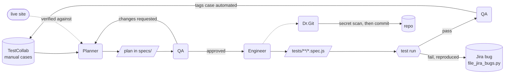

# Democracy Hub — Playwright test automation

Playwright end-to-end tests for the GLA Democracy Hub site (`test.registertovote.london`,
staging only — never production), generated from and traced back to test cases in
TestCollab.

Specs aren't written by hand: four agents pass work down a line, and each one re-checks the
previous one's claims against the source rather than trusting them. The split is deliberate —
only Engineer writes specs, only QA writes back to TestCollab, and only Dr.Git touches git.



Two conditions keep that loop honest: a failure only becomes a Jira bug after it is re-run and
fails a second time, and a case is only tagged `automated` after its spec has actually passed.

## Setup

```bash
npm install
npx playwright install
```

Copy the template and fill it in — it lists every variable the suite reads, what each one is
for, and which are optional:

```bash
cp .env.example .env
```

The public-site specs need nothing filled in. The authenticated ones need `TC_ADMIN_USER`,
`TC_ADMIN_PASS` and `TC_ADMIN_SESSION` (the last written for you by `npm run session` — see
"Authenticated tests" below). Everything else is optional.

## Running tests

```bash
npm test                # run everything
npm run test:smoke      # only the tests tagged @smoke
npm run test:regression # only the tests tagged @regression
npm run test:report     # run, then regenerate and open reports/test-report.html
npm run test:jira       # run, then file Jira bugs for failures that still reproduce
npm run test:full       # both of the above

npx playwright test --grep @smoke           # the same suite, straight through Playwright
npx playwright test --project=chromium      # a single browser
```

### Smoke and regression suites

A suite is a **tag on the test**, not a folder. Every test carries `{ tag: [...] }` after its
title, and a test can belong to both:

```js
test.describe('Header and Menu Functionality', { tag: ['@smoke', '@regression'] }, () => {
  test('Verify header and menu functionality', async ({ page }) => { ... });
});
```

When a file's `describe` block wraps more than one test, or there's no `describe` at all, the
tag goes on `test(...)` itself instead, right after the title.

| Tags | Tests | Meaning |
|---|---|---|
| `@smoke` `@regression` | 20 | The critical path — runs in both suites |
| `@regression` only | 48 | Deeper coverage that doesn't need to run on every smoke pass |
| `@smoke` only | 0 | Reserved: a smoke check not worth keeping in the full regression run |

**What earns a test `@smoke`:** it has to be fast, stable, and cover something whose failure
would leave the site *unusable* rather than merely degraded. In practice that is the public
pages a visitor hits first, the login and logout paths, one create per content type plus one
delete to prove the CMS round-trips, and the static guards, which cost nothing to run.
Everything else is regression: the mandatory-field and required-field variants, the edit and
front-end-display cases, and the duplicate per-type deletes. Those catch real bugs, but a
failure in one means a specific feature is wrong, not that the site is down.

`npm run test:smoke` and `npm run test:regression` (or `--smoke` / `--regression` on
`tools/run-tests.sh`, combinable) select by tag. Regression runs everything, because the
smoke tests carry both tags. To move a test between suites, edit its tag list — nothing else
about the file matters, and the suite a test is in never depends on its folder.

`npm test` (via `tools/run-tests.sh`) always records the run to `reports/run-history.json`,
even on failure, and exits with the tests' own exit code. It runs on **Chromium only** by
default (plus the Chromium-only `content-admin` login specs); pass `--all-browsers` for
chromium + firefox + webkit, or `--project=<name>` to choose. It also defaults to `--workers=1`, because the login specs share one admin account; pass `--workers=N` to override.

### Authenticated tests

Specs that need a logged-in admin session run in their own `content-admin` Playwright
project (see `AUTH_SPECS` in `playwright.config.js`) — each logs in fresh in an isolated
context and logs out afterwards. The staging account has a single-session limit, so
repeated logins kick each other out. Instead, log in **once a day** and let everything
reuse that session:

```bash
npm run session     # logs in through the real form, saves the session cookie to .env as TC_ADMIN_SESSION
```

With `TC_ADMIN_SESSION` set, `authHelper.login()` injects that cookie instead of using the
form, and `logout()` leaves the server session alone. Run the `content-admin` project
with `--workers=1`. If specs start failing with *"TC_ADMIN_SESSION is not a valid/live
session"*, the session expired — run `npm run session` again. (The Automated Logout
module is set to 2 hours of inactivity for every role, so a session left idle that long
can expire even within the same day.)

## Project structure

```
tests/
  auth/               login, logout, password-reset specs
  site/               public-site specs (no login): navigation/, pages/, search/
  cms/                logged-in content specs (the `content-admin` project), one folder per
                      content type: generic-page/ homepage/ landing-page/ resource/ news-blog/
  guards/             static repo checks, no browser: no hard-coded credentials, and every
                      spec carrying the `// case:` header the burndown and tagging rely on
  helpers/            reusable page-interaction helpers, shared across specs
  fixtures/           files the specs upload
  seed.spec.ts        the seed the planner/generator agents start from
specs/
  README.md           plan format, naming, and which agent writes/reviews/generates/tags
  tc-<id>-*-plan.md   automation plans. One plan often covers many cases, so a spec's case is
                      identified by its `// case: TC-<id>` header, not by the plan's filename
reports/
  run-history.json    every run's pass/fail counts (tracked; feeds the report and burndown)
  burndown-data.json  automated-vs-remaining history; burndown-chart.html is built from it
  test-report.html, broken-links-report.json, run-history-artifacts/   generated, not tracked
tools/
  run-tests.sh        the test runner wrapper (see npm scripts above)
  generate_report.py  builds reports/test-report.html from the latest JUnit run + run history
  render_burndown.py  builds reports/burndown-chart.html (automated vs. remaining over time)
  record_run_history.py
  file_jira_bugs.py   opt-in: files a Jira bug per still-reproducing failure
  refresh-session.js  logs in once and saves the session cookie to .env (`npm run session`)
  check-broken-links.js
  check_secrets.py, scrub_secrets.py, install-git-hooks.sh   keep secrets out of commits
.github/agents/       Claude agent definitions — see "Agent design" below
```

Which folder a spec goes in is about what it tests, not which suite it belongs to — suites
are tags (see "Smoke and regression suites"). A spec that needs a logged-in admin goes under
`tests/cms/` and must be listed in `AUTH_SPECS` in `playwright.config.js`.

## Reports

- `reports/test-report.html` — latest run, pass/fail breakdown, and a "Past runs" trend tab.
  Regenerate with `npm run test:report` or `python3 tools/generate_report.py`.
- `reports/burndown-chart.html` — TestCollab cases automated vs. remaining, over time.
  The automated count is **recomputed on every test run** by `tools/record_run_history.py`,
  which counts the distinct `// case: TC-<id>` headers across `tests/`, writes today's point
  to `reports/burndown-data.json` (replacing today's entry if it already exists) and
  re-renders the chart. Only `total` — the project's case count — is set by hand, because
  reading it would mean calling the TestCollab API after every run.
- `playwright-report/` — Playwright's own built-in HTML reporter for the most recent run.

## Evals

`promptfooconfig.yaml` grades the **agents**, not the site. Each of its 16 cases asks the
model to generate a Playwright spec from a real TestCollab case, then scores the result
against a rubric: does it reuse the existing helpers in `tests/helpers/` instead of
re-deriving locators, does it assert every expected result the case lists, does it avoid
inventing helper exports that don't exist, and is it a runnable spec rather than a sketch.

Alongside those 16 model-graded rubrics sits one deterministic JavaScript assertion, which
fails if a credential appears as a literal in generated code — the same rule
`tests/guards/no-hardcoded-credentials.spec.js` enforces on what's committed. It needs no
grader and cannot drift with model behaviour.

```bash
export ANTHROPIC_API_KEY=...        # the only secret the eval needs
npx --yes promptfoo@latest eval --no-cache --grader anthropic:messages:claude-sonnet-5
```

The `--grader` flag matters: the config's provider is Anthropic, but promptfoo's
model-graded assertions default to an OpenAI grader, so without it you'd need a second API
key for a provider this project doesn't otherwise use.

CI runs it via `.github/workflows/eval.yml` — on pushes to `main`, on pull requests that
touch `promptfooconfig.yaml` or `.github/agents/**`, and on manual dispatch. It is
deliberately not on every push, because every run costs API credits. The workflow reads
`ANTHROPIC_API_KEY` from a repository secret and uploads `eval-results.json` as an artifact.

The committed config is credential-free: the `scrub-secrets` clean filter (see
`tools/scrub_secrets.py`) replaces real values with `process.env.*` references on the way
into a commit, so the working copy can hold whatever it needs without that reaching the repo.

## TestCollab-driven workflow

Specs aren't written from scratch — they're generated from TestCollab's manual test
cases and kept traceable back to them:

1. **[Planner](.github/agents/Planner.agent.md)** fetches case(s) from TestCollab (by
   ID, suite, or filter), validates every step against the live site, and writes a plan
   to `specs/tc-<id>-*-plan.md` — including any drift found between what the case
   claims and what the app actually does. It then stops; it does not generate anything
   itself.
2. **[QA](.github/agents/QA.agent.md)** reviews that plan independently — re-verifying
   a sample of its claims against TestCollab and the live site, not just trusting the
   planner's own wording — and returns either **Approved** or **Changes requested**.
3. **[Engineer](.github/agents/Engineer.agent.md)** turns an *approved* plan into a
   spec in `tests/`, reusing helpers from `tests/helpers/` wherever one already covers
   a step, runs it, and reports pass or fail. Engineer has no TestCollab write access.
4. Once Engineer reports a pass, **QA** — the same agent that approved the plan, not
   Planner or Engineer — tags the corresponding TestCollab case `automated` and appends
   a pointer back to the spec file.

Alongside the pipeline, **[Dr.Git](.github/agents/DrGit.agent.md)** handles all Git work —
grouping changes into logical commits, keeping secrets and run artifacts out of them,
pushing and opening pull requests — and only when asked.

A spec's own header comment (`// spec: specs/tc-<id>-...-plan.md`) is the traceability
link back to its plan and TestCollab case — spec filenames are based on the test title,
not the TC ID.

## Agent design

Each agent in `.github/agents/` is scoped and constrained on purpose, not just prompted
to "write tests":

- **Planner** — never invents a scenario and presents it as a TestCollab case, and
  never silently "fixes" a case to match the app. Where the case and the live site
  disagree, it reports the drift instead of editing it away, so a human decides which
  side is wrong. Every scenario in its output is either traced to a real TC ID or
  explicitly marked `Proposed (not in TestCollab)`.
- **Triage before automating** — each case is classified as Automate, Automate with
  setup, Not worth automating, or Blocked, with a stated reason, rather than blindly
  generating a script for anything it's pointed at.
- **Tool-scoped** — `update_test_case` is never used to paper over drift, and Planner's
  write access is gated behind an explicit user request — it doesn't do the automatic
  post-pass tagging (that's QA's job, see below).
- **QA** is the independent gate between planning and generation — it re-checks a
  sample of the plan's claims itself rather than trusting the planner's own account,
  and can't edit the plan; it can only approve a plan or send specific, itemized
  changes back. A plan doesn't reach Engineer without QA's sign-off. QA is also the
  agent that closes the loop afterward: once Engineer reports a spec passed, QA — not
  Planner or Engineer — is the one that tags the TestCollab case `automated` and
  appends the spec-file pointer, the same independent-verification role just applied at
  the other end of the pipeline.
- **Engineer** turns an approved plan into a spec, reusing existing helpers wherever
  one already covers a step instead of re-deriving locators — and re-checks every TC ID
  against TestCollab one more time first, in case anything changed since QA approved
  it. It has no TestCollab write access at all: it runs the spec and reports pass/fail,
  and QA does the tagging.
- **Dr.Git** is the only agent that runs Git. It stages files by name (never `git add -A`),
  runs `tools/check_secrets.py` before every commit (blocking `.env`, tokens, session cookies
  and any value from `.env` — also enforced by a pre-commit hook and a scrub filter that keeps real credentials in `promptfooconfig.yaml` out of commits while leaving your local copy alone; both installed by `tools/install-git-hooks.sh`), splits work
  into logical commits, never adds AI attribution to commits or PRs, and won't push,
  force-push or hard-reset without an explicit instruction.
- **`playwright-test-healer`** fixes a failing spec without silently loosening its
  assertions.
- **`playwright-test-planner` / `playwright-test-generator`** — the same plan → generate
  discipline, for scenarios with no TestCollab case behind them.

Quality bar every plan is held to: traceable (every scenario ties back to a TC ID or is
marked proposed), honest (deferred cases and unverified steps are stated, not omitted),
executable, and independent (no scenario depends on another's leftovers).
